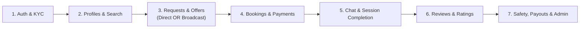

# Murafiq — End-to-End API Testing Lifecycle Guide

This guide walks you through testing the entire Murafiq marketplace lifecycle in **exact sequential order** using **100% verified request bodies and endpoints**.



---

## 🛠️ Environment & Pre-requisites

* **Base URL:** `http://localhost:4000/api/v1`
* **Bootstrap Admin Account:**
  ```bash
  npm run seed:admin
  ```
  *(Default Admin: `admin@murafiq.dev` / `AdminPass123!`)*

---

## Step 1: Authentication & Identity Verification (KYC)

### 1.1 Register Client
* **POST** `/auth/register`
```json
{
  "name": "Sarah Client",
  "email": "client@test.com",
  "password": "Password123!",
  "confirmpassword": "Password123!",
  "role": "client"
}
```

### 1.2 Verify Client Email
* **POST** `/auth/verify-email`
```json
{
  "email": "client@test.com",
  "otp": "123456"
}
```
*(Check console logs or email for OTP. In test/dev, OTP is logged).*

### 1.3 Register Stylist
* **POST** `/auth/register`
```json
{
  "name": "Layla Stylist",
  "email": "stylist@test.com",
  "password": "Password123!",
  "confirmpassword": "Password123!",
  "role": "stylist"
}
```

### 1.4 Verify Stylist Email
* **POST** `/auth/verify-email`
```json
{
  "email": "stylist@test.com",
  "otp": "123456"
}
```

### 1.5 Stylist Uploads KYC Document Photos (3 Times)
* **POST** `/uploads/kyc-documents`
* **Headers:** `Authorization: Bearer <STYLIST_TOKEN>`
* **Body:** `form-data` with key `file` (Select image file)
* *Run 3 times to get 3 Cloudinary URLs for front, back, and selfie.*

### 1.6 Stylist Submits KYC Verification Documents
* **PATCH** `/users/me/verification-documents`
* **Headers:** `Authorization: Bearer <STYLIST_TOKEN>`
```json
{
  "documents": [
    {
      "type": "national_id_front",
      "documentRef": "https://res.cloudinary.com/.../front.jpg"
    },
    {
      "type": "national_id_back",
      "documentRef": "https://res.cloudinary.com/.../back.jpg"
    },
    {
      "type": "selfie_with_id",
      "documentRef": "https://res.cloudinary.com/.../selfie.jpg"
    }
  ]
}
```

### 1.7 Admin Approves Stylist KYC
* **PATCH** `/admin/verifications/<STYLIST_USER_ID>/approve`
* **Headers:** `Authorization: Bearer <ADMIN_TOKEN>`
*(Stylist status is now `verified`).*

---

## Step 2: Profiles & Discovery

### 2.1 Stylist Creates Business Profile
* **POST** `/stylists/profile`
* **Headers:** `Authorization: Bearer <STYLIST_TOKEN>`
```json
{
  "specialty": "stylist",
  "bio": "Expert bridal hair stylist and makeup artist with 7 years experience.",
  "experienceYears": 7,
  "hourlyPrice": 1500,
  "services": [
    "Bridal Makeup",
    "Hair Styling",
    "Personal Shopping"
  ],
  "workingAreas": [
    "Downtown",
    "New Cairo",
    "Zamalek"
  ],
  "languages": [
    "Arabic",
    "English"
  ],
  "weeklyAvailability": [
    {
      "day": "sat",
      "startTime": "10:00",
      "endTime": "18:00"
    },
    {
      "day": "sun",
      "startTime": "10:00",
      "endTime": "18:00"
    }
  ]
}
```

### 2.2 Client Updates GPS Location & Profile
* **PATCH** `/users/me`
* **Headers:** `Authorization: Bearer <CLIENT_TOKEN>`
```json
{
  "lat": 30.0444,
  "lng": 31.2357,
  "country": "Egypt",
  "governorate": "Cairo",
  "city": "Cairo",
  "area": "Downtown"
}
```

### 2.3 Client Searches Nearby Stylists
* **GET** `/stylists?lat=30.0444&lng=31.2357&radiusKm=10`
* **Headers:** `Authorization: Bearer <CLIENT_TOKEN>`

---

## Step 3: Requests & Offers (Choose Option A or Option B)

Murafiq supports two marketplace matching models:
1. **Option A: Direct 1-to-1 Request** (Client targets one specific stylist).
2. **Option B: Open Broadcast Request** (Client posts to public board; nearby stylists bid with competing offers).

---

### 🔹 Option 3A: Direct 1-to-1 Request Flow

#### 3A.1 Client Creates Direct Request Targeted to Specific Stylist
* **POST** `/requests`
* **Headers:** `Authorization: Bearer <CLIENT_TOKEN>`
```json
{
  "visibility": "direct",
  "stylistId": "<STYLIST_USER_ID>",
  "title": "Bridal Hair & Makeup Session",
  "description": "Looking for classic bridal makeup and updo hair style.",
  "date": "2026-09-15T18:00:00.000Z",
  "time": "18:00",
  "budgetRange": {
    "min": 1000,
    "max": 2000
  },
  "meetingLocation": {
    "address": "123 Nile Street",
    "country": "Egypt",
    "governorate": "Cairo",
    "city": "Cairo",
    "area": "Downtown",
    "lat": 30.0444,
    "lng": 31.2357
  }
}
```
*(Copy `id` from response — this is the `<REQUEST_ID>`).*

#### 3A.2 Stylist Views Incoming Targeted Requests
* **GET** `/requests/incoming`
* **Headers:** `Authorization: Bearer <STYLIST_TOKEN>`

#### 3A.3 Stylist Submits Offer on the Direct Request
* **POST** `/offers/requests/<REQUEST_ID>`
* **Headers:** `Authorization: Bearer <STYLIST_TOKEN>`
```json
{
  "price": 1500,
  "duration": 90,
  "message": "I can accommodate this time and will bring all required equipment."
}
```
*(Copy `id` from response — this is the `<OFFER_ID>`).*

---

### 🔹 Option 3B: Open Broadcast Request Flow (Marketplace Bidding)

#### 3B.1 Client Posts Open Broadcast Request (No Stylist Selected)
* **POST** `/requests`
* **Headers:** `Authorization: Bearer <CLIENT_TOKEN>`
```json
{
  "visibility": "broadcast",
  "title": "Need Urgent Makeup & Hair for Engagement Party",
  "description": "Looking for soft glam makeup and Hollywood waves for engagement.",
  "date": "2026-09-20T16:00:00.000Z",
  "time": "16:00",
  "budgetRange": {
    "min": 1200,
    "max": 2500
  },
  "meetingLocation": {
    "address": "Villa 45, 1st Settlement",
    "country": "Egypt",
    "governorate": "Cairo",
    "city": "New Cairo",
    "area": "First Settlement",
    "lat": 30.0244,
    "lng": 31.4357
  }
}
```
*(Notice: No `stylistId` is sent. Copy `id` from response — this is the `<BROADCAST_REQUEST_ID>`).*

#### 3B.2 Stylists Discover Open Job Opportunities via Feed
* **GET** `/requests/feed?city=New%20Cairo&lat=30.0244&lng=31.4357&radiusKm=20`
* **Headers:** `Authorization: Bearer <STYLIST_TOKEN>`
*(Returns all active broadcast requests near the stylist).*

#### 3B.3 Multiple Stylists Submit Competing Sealed-Bid Offers
* **POST** `/offers/requests/<BROADCAST_REQUEST_ID>`
* **Headers:** `Authorization: Bearer <STYLIST_A_TOKEN>`
```json
{
  "price": 1400,
  "duration": 75,
  "message": "Special engagement package offer with luxury makeup brands."
}
```
*(Stylist B can also send a competing offer of 1,600 EGP. Stylists cannot see competitor prices; only client sees all bids).*

---

## Step 4: Bookings & Payments

### 4.1 Client Accepts Winning Offer (Creates Booking)
* **PATCH** `/offers/<OFFER_ID>/accept`
* **Headers:** `Authorization: Bearer <CLIENT_TOKEN>`
*(Returns the new Booking with `status: "pending"`. For broadcast requests, all other losing sibling offers are automatically closed to `"rejected"` — copy `_id` as `<BOOKING_ID>`).*

### 4.2 Client Initializes Payment
* **POST** `/payments/<BOOKING_ID>/initialize`
* **Headers:** `Authorization: Bearer <CLIENT_TOKEN>`
*(No request body needed — returns payment order details).*

### 4.3 Payment Completion Webhook (Mock Provider)
* **POST** `/payments/callback`
```json
{
  "type": "TRANSACTION",
  "obj": {
    "id": 12345678,
    "success": true,
    "order": {
      "merchant_order_id": "<PAYMENT_ID>"
    }
  }
}
```
*(Booking status now transitions to `"confirmed"`).*

---

## Step 5: Chat, Notifications & Service Session

### 5.1 Send Real-Time Chat Message
* **POST** `/chat/<BOOKING_ID>/messages`
* **Headers:** `Authorization: Bearer <CLIENT_TOKEN>`
```json
{
  "content": "Hi Layla! Looking forward to our session.",
  "type": "text"
}
```

### 5.2 Check Notification Feed
* **GET** `/notifications`
* **Headers:** `Authorization: Bearer <STYLIST_TOKEN>`

### 5.3 Stylist Starts Session (Check-in)
* **PATCH** `/bookings/<BOOKING_ID>/check-in`
* **Headers:** `Authorization: Bearer <STYLIST_TOKEN>`
*(Booking status transitions to `"in-progress"`).*

### 5.4 Stylist Completes Session
* **PATCH** `/bookings/<BOOKING_ID>/confirm-completion`
* **Headers:** `Authorization: Bearer <STYLIST_TOKEN>`
*(Booking status transitions to `"completed"`).*

---

## Step 6: Two-Way Reviews & Ratings

### 6.1 Client Reviews Stylist
* **POST** `/bookings/<BOOKING_ID>/review`
* **Headers:** `Authorization: Bearer <CLIENT_TOKEN>`
```json
{
  "rating": 5,
  "comment": "Outstanding bridal styling! On time, professional, and amazing result."
}
```

### 6.2 Stylist Reviews Client
* **POST** `/bookings/<BOOKING_ID>/review`
* **Headers:** `Authorization: Bearer <STYLIST_TOKEN>`
```json
{
  "rating": 5,
  "comment": "Great client, very hospitable and punctual."
}
```

### 6.3 View My Reviews
* **GET** `/reviews/mine`
* **Headers:** `Authorization: Bearer <STYLIST_TOKEN>`

---

## Step 7: Payouts & Admin Management

### 7.1 Stylist Registers Payout Account
* **PATCH** `/payouts/account`
* **Headers:** `Authorization: Bearer <STYLIST_TOKEN>`
```json
{
  "method": "vodafone_cash",
  "walletPhone": "01012345678"
}
```

### 7.2 Admin Inspects Pending Balances
* **GET** `/payouts/admin/pending-balances`
* **Headers:** `Authorization: Bearer <ADMIN_TOKEN>`

### 7.3 Admin Creates Payout Batch
* **POST** `/payouts/admin/batch`
* **Headers:** `Authorization: Bearer <ADMIN_TOKEN>`
```json
{
  "stylistIds": [
    "<STYLIST_USER_ID>"
  ],
  "holdWindowHours": 0
}
```
*(Returns created payout batch items — copy the payout item `<PAYOUT_ID>`).*

### 7.4 Admin Marks Payout as Paid
* **PATCH** `/payouts/admin/<PAYOUT_ID>/mark-paid`
* **Headers:** `Authorization: Bearer <ADMIN_TOKEN>`
```json
{
  "reference": "VFCASH-99887766"
}
```

### 7.5 Admin Dashboard Statistics
* **GET** `/admin/dashboard/stats`
* **Headers:** `Authorization: Bearer <ADMIN_TOKEN>`
*(Returns platform metrics: user counts, active/completed bookings, gross revenue, and 15% platform commission).*

### 7.6 Admin Audit Logs
* **GET** `/admin/audit-logs`
* **Headers:** `Authorization: Bearer <ADMIN_TOKEN>`
