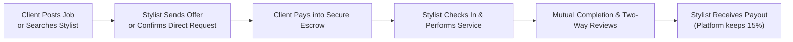
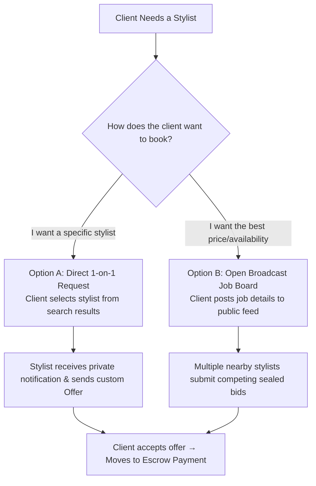
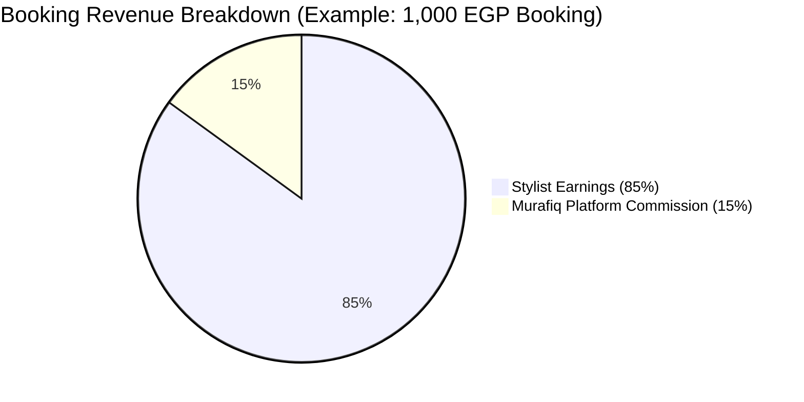
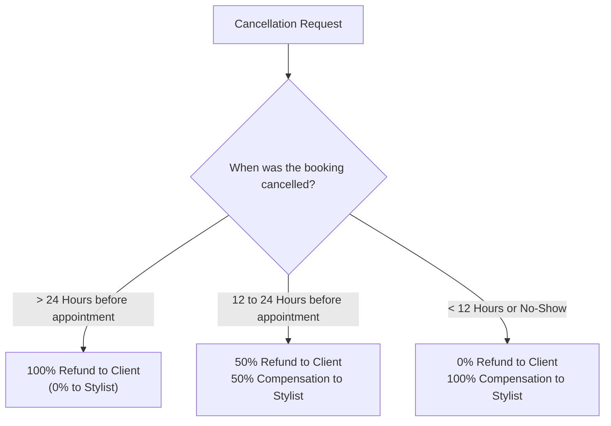

# Murafiq (مُرافِق) — Master Product, Business & User Experience Guide

> **A Comprehensive, Non-Technical Overview of Murafiq**  
> *Designed for founders, product managers, investors, clients, and developers.*

---

## 1. Executive Summary & Value Proposition

### 1.1 What is Murafiq?
**Murafiq** is a two-sided on-demand beauty and styling marketplace operating in Egypt. It connects clients with vetted, independent beauty professionals (hair stylists, makeup artists, personal fashion consultants, and bridal specialists) for private, in-person appointments at homes, hotels, or event venues.

Think of Murafiq as combining the **convenience of Uber**, the **trust and escrow security of Airbnb**, and the **competitive bidding power of Upwork/Fiverr** — tailored specifically for the multi-million-dollar beauty and fashion industry in Egypt.

---

### 1.2 The Core Problems Murafiq Solves

| For Clients (Women, Brides, Event Attendees) | For Stylists (Freelance Professionals) |
|---|---|
| **Fragmented Discovery:** Finding trusted stylists via Instagram DMs or word-of-mouth is slow and unorganized. | **Inconsistent Income:** Stylists struggle with empty calendar slots between wedding seasons. |
| **Price Opacity:** No standard pricing; clients are frequently overcharged or quoted arbitrary rates. | **Payment Ghosting:** Clients cancel last minute or delay paying after services are delivered. |
| **Safety Concerns:** Allowing strangers into homes without background verification creates anxiety. | **No Booking Contract:** Stylists waste time negotiating with indecisive clients without guaranteed deposits. |
| **Murafiq Solution:** Verified National IDs, upfront price quotes, sealed-bid competition, and 100% escrow protection. | **Murafiq Solution:** Guaranteed upfront client payments, automatic calendar protection, and scheduled payouts. |

---

## 2. The Three Platform Roles

### 👤 1. The Client
* **Who they are:** Individuals booking bridal services, event makeup, hair styling, or personal styling sessions.
* **Key Capabilities:**
  * Search nearby stylists by location, specialty, rating, and price.
  * Send direct booking requests to specific favorite stylists.
  * Post open broadcast jobs to receive competing bids from multiple stylists.
  * Pay securely through online payment gateways with money held in escrow.
  * Chat in real-time with booked stylists.
  * Rate and review stylists after sessions.

---

### 💇 2. The Stylist
* **Who they are:** Identity-verified freelance beauty and fashion professionals.
* **Key Capabilities:**
  * Create a public business profile showcasing services, hourly rates, languages, and photo portfolios.
  * Define geographic coverage areas (`workingAreas`: e.g., New Cairo, Zamalek, Sheikh Zayed, Maadi).
  * Set weekly working hours (e.g., Saturdays & Sundays from 10:00 to 18:00).
  * Receive direct client booking inquiries.
  * Browse the **Open Broadcast Job Feed** to bid on open styling jobs nearby.
  * Check in via GPS upon arrival at the client's location.
  * Receive 85% net earnings paid out via Vodafone Cash, InstaPay, or Bank Transfer.

---

### 🛡️ 3. The Admin / Platform Manager
* **Who they are:** Operations, trust & safety, and finance team managing platform integrity.
* **Key Capabilities:**
  * Review and approve/reject stylist National ID cards and verification selfies.
  * Monitor real-time platform statistics (gross revenue, active bookings, 15% platform commission).
  * Arbitrate client/stylist disputes and authorize full or partial refunds.
  * Suspend bad-actor accounts and moderate inappropriate reviews.
  * Disburse batch payout transfers to stylists.
  * Access full, tamper-proof audit trails of all sensitive administrative actions.

---

## 3. The Complete Step-by-Step User Journey

### Stage 1: Trust, Security & Onboarding (KYC)
1. **Account Creation:** Users register as either a Client or Stylist and verify their email via a 6-digit one-time passcode (OTP).
2. **Stylist Identity Verification (KYC):** To ensure maximum client safety, stylists must upload **3 high-resolution documents**:
   * Front of Egyptian National ID.
   * Back of Egyptian National ID.
   * A clear selfie holding their National ID next to their face.
3. **Admin Verification Gate:** The stylist **remains hidden from public search** until an Admin manually audits and approves their credentials.

---

### Stage 2: Service Discovery & Matching (Two Modes)

Murafiq uniquely offers **two matching mechanisms** to satisfy different client behaviors:

#### 🔹 Mode A: Direct 1-to-1 Booking (Targeted Selection)
* **How it works:** The client browses the stylist directory, filters by rating or location, views Layla's portfolio, and clicks *"Request Booking"*.
* **Best for:** Clients who already know which specific professional they want to hire.
* **Workflow:** Sent directly to Layla $\rightarrow$ Layla reviews $\rightarrow$ Layla replies with a customized offer (`price: 1,500 EGP`, `duration: 90 mins`).

#### 🔹 Mode B: Open Broadcast Job Board (Competitive Bidding)
* **How it works:** The client posts an open job: *"Need bridal makeup in New Cairo on Sept 15, Budget: 1,000–2,000 EGP"* without selecting a stylist.
* **Best for:** Clients looking for the best price, urgent last-minute bookings, or clients who don't know who to choose.
* **Workflow:** Appears on the **Stylist Job Feed** for all verified stylists serving New Cairo $\rightarrow$ Multiple stylists submit bids $\rightarrow$ Client compares bids and picks the winner.
* **Sealed-Bid Rule:** Clients see all competing prices. Stylists **never** see competitor prices on the same job, preventing harmful price-slashing wars while maximizing client choice.

---

### Stage 3: The Booking & Escrow Handshake
1. **Offer Acceptance:** The client selects and accepts an offer.
2. **Automatic Winner Lock:** The moment one offer is accepted, all other competing bids on that broadcast job are automatically marked as `rejected`, releasing the other stylists' calendars.
3. **Calendar Blocking:** The platform locks the stylist's schedule for that exact date and time, preventing double-booking.
4. **100% Upfront Escrow Payment:**
   * The client pays the full amount online.
   * **The money is NOT sent to the stylist immediately.**
   * The platform securely holds the funds in **escrow** until the service is successfully rendered.

---

### Stage 4: In-Session Experience & Fulfillment
1. **Real-Time Communication:** Once payment is confirmed, an encrypted in-app chat room unlocks between client and stylist.
2. **Stylist Arrival (Check-in):** Upon arriving at the client's home or venue, the stylist taps **"Check-in"** in the app. The booking status transitions to `in-progress`.
3. **Session Completion:** Once the makeup/hair styling is finished, the stylist taps **"Complete Session"**. The client confirms completion.

---

### Stage 5: Reputation, Trust & Reviews
1. **Two-Way Reviews:** Both the client and the stylist rate each other (1 to 5 stars) and write written reviews.
2. **Verified Reputation:** Only users with completed, paid bookings can submit reviews, preventing fake reviews.
3. **Aggregated Ratings:** The stylist's public rating and badge score automatically update in real-time.

---

## 4. Monetization & Business Model

Murafiq operates on a proven **take-rate commission model** with zero upfront subscription fees for stylists:

### 4.1 Platform Commission (15%)
* On every completed booking, Murafiq retains a **15% platform fee**.
* Example:
  * Client pays: **1,000 EGP**
  * Platform Commission (15%): **150 EGP** (Murafiq gross revenue)
  * Stylist Net Earnings (85%): **850 EGP**

---

### 4.2 Stylist Payouts & Disbursements
* **Holding Window:** Earnings are held for **48 hours** following session completion to ensure no disputes or quality issues arise.
* **Disbursement Channels:** Stylists register their preferred Egyptian payout account:
  1. **Vodafone Cash / Mobile Wallets**
  2. **InstaPay (IPN)**
  3. **Egyptian Bank Accounts (IBAN transfer)**
* **Admin Batch Payouts:** Operations teams run scheduled disbursements to release eligible balances with unique bank transaction tracking numbers.

---

## 5. Comprehensive Business Rules & System Caps

To prevent platform abuse, spam, and financial fraud, Murafiq enforces strict, automated business rules:

| Category | Business Rule | Exact Limit / Parameter | Rationale |
|---|---|---|---|
| **Client Requests** | Verified Client Daily Cap | **5 requests / day** | Allows clients to book multiple event services while stopping spam bots. |
| **Client Requests** | Unverified Client Daily Cap | **2 requests / day** | Throttles unverified accounts until they establish trust. |
| **Stylist Bidding** | Broadcast Job Bidding Cap | **5 bids / day** | Prevents stylists from blindly spam-bidding on every job across Egypt. |
| **Stylist Bidding** | Direct Request Responses | **UNLIMITED** | Stylists should never be blocked from accepting direct client inquiries. |
| **Stylist Bidding** | Active Offer Limit | **1 active offer per client** | Prevents a stylist from sending multiple competing quotes to the same person. |
| **Pricing** | Minimum Service Price | **100 EGP** | Prevents micro-transaction fraud and guarantees minimum earning standards. |
| **Timers** | Request Expiration Window | **48 Hours** | Auto-closes stale requests if no offer is accepted, keeping the job board fresh. |
| **Timers** | Offer Expiration Window | **24 Hours** | Stylists' quoted prices are held firm for 24 hours. |
| **Timers** | Dispute Filing Window | **48 Hours** | Clients have 2 full days after a session to report quality or no-show issues. |
| **Security** | OTP Verification Lockout | **5 failed attempts** | Locks out brute-force attacks on phone/email verification codes. |
| **Security** | Password Standard | **Bcrypt 12 Rounds** | Military-grade password hashing protecting user credentials. |

---

## 6. Cancellation & Refund Policy

Murafiq uses a **fair, time-tiered cancellation structure** that protects clients from unfair charges while compensating stylists for blocked calendar time:

1. **More than 24 hours before appointment:**
   * Client receives **100% full refund**.
   * Stylist schedule is unlocked with no penalties.
2. **Between 12 and 24 hours before appointment:**
   * Client receives **50% refund**.
   * Stylist receives **50% compensation** for lost booking time.
3. **Less than 12 hours before appointment (or client no-show):**
   * **0% refund** to client.
   * Stylist receives **100% payout** (minus platform fee) because the time slot could not be re-sold.
4. **Stylist Cancellation / No-Show:**
   * Client receives **100% immediate full refund**.
   * Stylist receives an internal reliability penalty on their search ranking.

---

## 7. Customer Protection & Dispute Arbitration

To maintain trust between strangers meeting in private homes:

1. **48-Hour Escrow Hold:** Funds are never instantly transferred to a stylist; they remain in escrow during the 48-hour satisfaction window.
2. **Filing a Dispute:** If a client experiences a no-show, severe lateness, or service discrepancy, they can click *"File Dispute"* within 48 hours and upload photo evidence.
3. **Admin Arbitration:** The platform manager reviews:
   * The client's complaint & photos.
   * The GPS arrival check-in timestamp.
   * The in-app chat transcript.
4. **Dispute Outcomes:**
   * **Full Refund:** Returned to client if the stylist failed to perform the service.
   * **Partial Refund:** Customized percentage split agreed upon by arbitration.
   * **Release to Stylist:** If the dispute is deemed fraudulent and service was delivered as promised.

---

## 8. Summary: Why Murafiq Wins

1. **Safety First:** Strict National ID KYC ensures only verified beauty professionals enter clients' homes.
2. **Financial Peace of Mind:** Clients' money is protected in escrow; stylists are guaranteed 100% payment without chasing clients.
3. **Marketplace Flexibility:** Offers both direct bespoke bookings and open competitive bidding.
4. **Built for Scale:** Clean separation of concerns, robust transaction concurrency guards, and full administrative audit logging.
