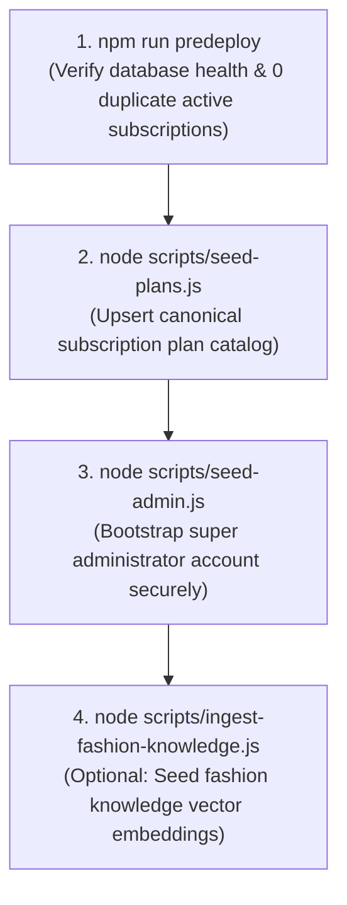
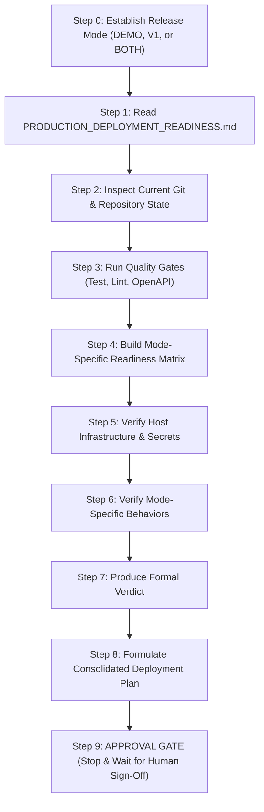

# Murafiq — Production Deployment Readiness & Operations Guide

> **Permanent Source-of-Truth Document for Murafiq Production Deployments**  
> **Status:** Live Operational Contract  
> **Baseline Commit Baseline:** Post-Remediation Verification (Groups A–F, Final Release Audit & Email PII Micro-Fix Complete)

---

## 1. Purpose & Authority

This document is the **permanent source of truth** for all future production deployments of the Murafiq backend.

Whenever an engineering prompt requests production deployment (e.g., *"يلا هنطلع production"*, *"Let's deploy to production"*, *"جهزنا نطلع production"*, *"prepare for production"*, or *"start production deployment"*), the orchestrating agent **MUST**:

1. **Read this document completely.**
2. **Determine the intended release mode (`DEMO`, `V1`, or `BOTH`).**
3. **Inspect the CURRENT repository and host configuration.**
4. **Compare the live repository state against this specification.**
5. **Verify which pre-deployment actions are still pending.**
6. **Identify any code or configuration changes introduced since this document's baseline.**
7. **Produce a fresh, evidence-based release-readiness evaluation.**
8. **Draft a consolidated, step-by-step deployment plan.**
9. **STOP and wait for explicit human approval before executing any deployment action.**

> [!IMPORTANT]
> **Dynamic Verification Rule:** Never blindly execute this document as a static checklist. The live repository, current code, and runtime configuration take absolute precedence over stale documentation assumptions.

---

## 2. Production Release Mode — Mandatory First Step

Murafiq supports two distinct operational API modes:
* **`DEMO`**: Trial sandbox marketplace with Cash-on-Delivery (COD) simulation, free-tier subscription access, and bypassed payment gateways.
* **`V1`**: Real production marketplace with Paymob payment processing, real subscription billing, double-entry financial ledger accounting, and stylist payouts.
* **`BOTH`**: Both modes run concurrently on the same host instance under partitioned route prefixes (`/api/demo/*` and `/api/v1/*`).

### The Release Mode Decision Gate
Before planning or executing ANY deployment step, the deployment mode **MUST BE EXPLICITLY ESTABLISHED**.

The agent must NEVER silently assume `V1`, nor silently assume `DEMO`. If the user prompt did not state the mode explicitly, the agent must ask:

> **"Which production release are we deploying: DEMO, V1, or BOTH?"**

No readiness plan or deployment procedure may proceed until this decision is confirmed.

---

## 3. Detailed Release Mode Definitions

### 3.1. Mode: `DEMO`
* **Route Prefix:** Exclusively mounts `/api/demo/*`.
* **Payments:** No Paymob API calls; no online credit card processing.
* **Commerce & Orders:** No production checkout or order polling.
* **Checkout Behavior:** Uses Cash-on-Delivery (COD) simulator (`paymentMethod: 'cash'`).
* **Subscriptions:** Restricted to Free tier plans (`tier: 'free'` or `priceEgp: 0`). Commerce routes (`/checkout`, `/subscribe`, `/orders`, `/cancel`) are omitted.
* **Financial Side Effects:** Completed bookings are marked with `payoutStatus: 'not_owed'`. Bypasses platform fees, escrow holds, stylist payout allocations, and `LedgerEntry` writes.
* **Booking Lifecycle:** Full scheduling, calendar blocking, mutual check-in, and review loops remain fully operational.

### 3.2. Mode: `V1`
* **Route Prefix:** Exclusively targets production routes under `/api/v1/*`.
* **Payments:** Full Paymob payment gateway integration (Cards, Mobile Wallets) via `PAYMENT_PROVIDER=paymob`.
* **Commerce & Subscriptions:** Paid plan grants, Paymob subscription checkout, order polling, and webhook verification.
* **Escrow & Ledger:** Escrow holds on `Payment.status === 'paid'`, double-entry ledger postings (`amountMinor`), and automated midnight reconciliation.
* **Payouts:** Stylist payout eligibility calculation on mutual check-in/completion, administrative batch payouts, and dispute-adjusted settlements.
* **External Services:** Mandates live credentials for Resend, Cloudinary, Firebase Admin, Gemini Vision, and Upstash Vector.

### 3.3. Mode: `BOTH`
* **Route Structure:** Both `/api/demo/*` and `/api/v1/*` are mounted simultaneously on the single API server.
* **Isolation Guarantees:**
  * Requests to `/api/demo/*` attach `req.bookingMode = 'demo'` via middleware.
  * Demo bookings write `booking.bookingMode: 'demo'` to the database.
  * Core services strictly guard financial side effects behind `if (booking.bookingMode !== 'demo')`.
  * Demo traffic cannot create Paymob intentions, lock escrow, alter ledger accounts, or generate stylist payouts.
  * Shared infrastructure (MongoDB, Redis, BullMQ workers) must be verified for multi-tenant stability without cross-mode data pollution.

---

## 4. Mode-Aware Production Requirements Matrix

| Requirement | DEMO Mode | V1 Mode | BOTH Mode | Verification Procedure at Deployment |
| :--- | :---: | :---: | :---: | :--- |
| **MongoDB Multi-Doc Transactions** | **Mandatory** | **Mandatory** | **Mandatory** | Confirm MongoDB deployment is a Replica Set (`withTransaction` required). |
| **Redis & BullMQ** | **Mandatory** | **Mandatory** | **Mandatory** | Confirm Redis host connectivity for `wardrobe` and `tryon` job queues. |
| **Paymob Gateway** | ❌ Bypassed | **Mandatory** | **Mandatory** | Verify API keys, HMAC secret, card integration IDs, and notification URLs. |
| **Resend Mail Service** | **Mandatory** | **Mandatory** | **Mandatory** | Confirm `RESEND_API_KEY`, verified sending domain, and `MAIL_TO_ADDRESS` is unset. |
| **Cloudinary Media Storage** | **Mandatory** | **Mandatory** | **Mandatory** | Confirm credentials for avatar, KYC identity docs, and wardrobe uploads. |
| **Firebase Admin SDK** | **Mandatory** | **Mandatory** | **Mandatory** | Confirm GCP Project ID, client email, and RSA private key for chat & FCM. |
| **Gemini AI API Key** | **Mandatory** | **Mandatory** | **Mandatory** | Confirm `GEMINI_API_KEY` for wardrobe garment vision tagging and stylist chat. |
| **Upstash Vector (Wardrobe)** | **Mandatory** | **Mandatory** | **Mandatory** | Confirm REST URL & Token for per-user wardrobe item embeddings. |
| **Upstash Vector (Fashion KB)**| Optional | Optional | Optional | Required if Fashion Knowledge Base RAG is active. |
| **Daily Ledger Reconciliation**| Optional | **Mandatory** | **Mandatory** | Verifies zero accounting drift on V1 payments and ledger entries. |
| **Payment Webhook Callback** | ❌ Not Used | **Mandatory** | **Mandatory** | Confirm `POST /api/v1/payments/callback` is publicly reachable and validly signed. |
| **Production Stylist Payouts** | ❌ Not Owed | **Mandatory** | **Mandatory** | Confirm payout authorization models and administrative batch processing. |
| **Demo COD Simulation** | **Mandatory** | ❌ Disabled | **Mandatory** | Confirm demo bookings execute without requiring gateway payment check-ins. |
| **Demo Route Mounting** | **Mounted** | ❌ Omitted | **Mounted** | Inspect `src/app.js` and `src/routes/demo.routes.js`. |
| **V1 Route Mounting** | ❌ Omitted | **Mounted** | **Mounted** | Inspect `src/app.js` and `src/routes/index.js`. |
| **PM2 Background Workers** | **Mandatory** | **Mandatory** | **Mandatory** | Confirm `murafiq-worker-wardrobe` and `murafiq-worker-tryon` run via PM2. |

---

## 5. Production Requirement 01 — MongoDB & Persistence

### 5.1. Transaction Engine Invariant
```text
MongoDB deployment must support multi-document transactions.
```
* **Architecture:** All financial operations, state-machine transitions, and booking creations rely on Mongoose sessions via `withTransaction()` ([`src/common/transaction.util.js`](file:///c:/Users/Mohand/Documents/GitHub/Murafiq/src/common/transaction.util.js)).
* **Topology:** Multi-document transactions require a MongoDB Replica Set (or Sharded Cluster). Running on a standalone MongoDB instance causes immediate transaction rejection.
* **Atlas Compatibility:** Standard MongoDB Atlas connection strings (`mongodb+srv://...`) automatically discover replica set topology via DNS SRV records without requiring an explicit `replicaSet=` parameter in the URI.
* **Connection Pool Settings:** Configured in [`src/config/database.config.js`](file:///c:/Users/Mohand/Documents/GitHub/Murafiq/src/config/database.config.js):
  * `maxPoolSize`: 50
  * `minPoolSize`: 5
  * `serverSelectionTimeoutMS`: 5000 (fails fast if cluster is unreachable)
  * `socketTimeoutMS`: 45000

### 5.2. Mandatory Database Indexes & Integrity Constraints
* **Active Subscriptions:** Partial unique index on `{ userId: 1, status: 1 }` where `status: 'active'`. Prevents duplicate active subscriptions per user.
* **Reviews:** Unique compound index on `{ bookingId: 1, direction: 1 }`. Ensures two-way review integrity.
* **Ledger Entries:** Unique compound index on `{ bookingId: 1, sequence: 1 }` and sequence hashing to prevent ledger double-posting.
* **Geospatial Index:** `2dsphere` index on `StylistProfile.location` and `User.location` indexing GeoJSON `[longitude, latitude]`.

---

## 6. Production Requirement 02 — Redis & BullMQ Workers

### 6.1. Redis Configuration
* **Connection String:** Provided via `REDIS_URL` (e.g. `redis://:password@redis-host:6379`).
* **Client Implementation:** Uses `ioredis` with automated reconnect logic and offline command queueing.

### 6.2. Background Worker Model
Workers do **NOT** run inside the web API server process. They are partitioned into dedicated background runner scripts:
1. `murafiq-worker-wardrobe` (`src/jobs/workers/wardrobe-worker.runner.js`): Consumes `wardrobe-classification` jobs (Gemini Vision parsing + Upstash indexing).
2. `murafiq-worker-tryon` (`src/jobs/workers/tryon-worker.runner.js`): Consumes async AI virtual try-on image generation tasks.

### 6.3. Graceful Worker Teardown
Both worker runners listen for `SIGTERM` and `SIGINT`, pause their respective BullMQ queues, await in-flight job completion (up to 10s), and close Redis connections cleanly before exiting.

---

## 7. Production Requirement 03 — Environment Variables & Secrets

Never store plaintext credentials or secrets in Git or documentation. The following matrix specifies all environment variables validated at boot by [`src/config/env.config.js`](file:///c:/Users/Mohand/Documents/GitHub/Murafiq/src/config/env.config.js):

| Variable | Classification | Rule & Production Constraints |
| :--- | :---: | :--- |
| `NODE_ENV` | **REQUIRED** | Must be strictly `'production'`. Enforces secret validation and disables stack leak traces. |
| `PORT` | **REQUIRED** | Production HTTP listening port (default `4000`). |
| `API_URL` | **REQUIRED** | Canonical backend URL (e.g. `https://api.murafiq.com`). Used for callback generation. |
| `CLIENT_URL` | **REQUIRED** | Web frontend origin (e.g. `https://murafiq.com`). Enforced by CORS middleware. |
| `MONGO_URI` | **REQUIRED** | Production MongoDB connection string supporting multi-document transactions. |
| `JWT_ACCESS_SECRET` | **REQUIRED** | High-entropy random string (>= 32 chars). Boot fails if left as dev placeholder. |
| `JWT_REFRESH_SECRET` | **REQUIRED** | High-entropy random string (>= 32 chars). Boot fails if left as dev placeholder. |
| `JWT_ACCESS_EXPIRES_IN` | OPTIONAL | Access token lifetime string (default `'15m'`). |
| `JWT_REFRESH_EXPIRES_IN`| OPTIONAL | Refresh token lifetime string (default `'7d'`). |
| `REDIS_URL` | **REQUIRED** | Connection string to Redis instance for BullMQ queues. |
| `MAIL_PROVIDER` | **REQUIRED** | **Must be set to `'resend'`**. (`sendgrid` is an unbuilt 501 stub). |
| `RESEND_API_KEY` | **REQUIRED** | Active Resend production API key. |
| `MAIL_FROM_ADDRESS` | **REQUIRED** | Verified sending domain email (e.g. `noreply@murafiq.com`). |
| `MAIL_TO_ADDRESS` | **MUST BE UNSET** | If set, all outgoing platform emails redirect to this single address (dev capture mode). |
| `PAYMENT_PROVIDER` | MODE-DEPENDENT | Must be `'paymob'` for V1 and BOTH modes (`'mock'` permitted in standalone DEMO). |
| `PAYMOB_API_KEY` | MODE-DEPENDENT | Mandatory for V1 / BOTH. Production Paymob merchant API key. |
| `PAYMOB_SECRET_KEY` | MODE-DEPENDENT | Mandatory for V1 / BOTH. Production Paymob secret key. |
| `PAYMOB_PUBLIC_KEY` | MODE-DEPENDENT | Mandatory for V1 / BOTH. Production Paymob public key. |
| `PAYMOB_HMAC_SECRET` | MODE-DEPENDENT | Mandatory for V1 / BOTH. HMAC secret for authenticating inbound webhook callbacks. |
| `PAYMOB_CARD_INTEGRATION_ID` | MODE-DEPENDENT | Mandatory for V1 / BOTH. Paymob live iframe card integration ID. |
| `PAYMOB_NOTIFICATION_URL` | MODE-DEPENDENT | Webhook callback URL (`https://api.murafiq.com/api/v1/payments/callback`). |
| `CLOUDINARY_CLOUD_NAME` | **REQUIRED** | Cloudinary tenant account name. |
| `CLOUDINARY_API_KEY` | **REQUIRED** | Cloudinary API key. |
| `CLOUDINARY_API_SECRET` | **REQUIRED** | Cloudinary API secret for authenticated asset uploads. |
| `FIREBASE_PROJECT_ID` | **REQUIRED** | GCP project ID for Firestore chat and FCM notifications. |
| `FIREBASE_CLIENT_EMAIL`| **REQUIRED** | Firebase Admin service account client email. |
| `FIREBASE_PRIVATE_KEY` | **REQUIRED** | RSA PEM private key for Firebase Admin SDK. |
| `GEMINI_API_KEY` | **REQUIRED** | Google Gemini API key for vision classification and AI Stylist consultation. |
| `UPSTASH_VECTOR_REST_URL` | **REQUIRED** | Upstash Vector REST endpoint for user wardrobe item embeddings. |
| `UPSTASH_VECTOR_REST_TOKEN` | **REQUIRED** | Upstash Vector REST token for user wardrobe item embeddings. |
| `UPSTASH_KB_VECTOR_REST_URL`| FEATURE-DEPENDENT | Upstash Vector REST endpoint for fashion knowledge base corpus. |
| `UPSTASH_KB_VECTOR_REST_TOKEN`| FEATURE-DEPENDENT | Upstash Vector REST token for fashion knowledge base corpus. |
| `ALERT_EMAIL` | OPTIONAL / RECOM. | Email address for automated midnight ledger reconciliation alerts (OBS-04). |
| `ALERT_WEBHOOK_URL` | OPTIONAL / RECOM. | HTTPS webhook destination for automated ledger discrepancy alerts (OBS-04). |
| `AI_TRY_ON_ENABLED` | FEATURE-DEPENDENT | Boolean (`true`/`false`). If true, requires `AI_IMAGE_PROVIDER` (`gemini`) & `GEMINI_API_KEY`. |
| `MODERATION_MODE` | OPTIONAL | Set to `'ENFORCE'` in production (defaults to `'DRY_RUN'`). |

---

## 8. Production Requirement 04 — Database Seeding & Pre-Deployment Scripts

### 8.1. Execution Order & Script Specifications



#### 1. Sanity Gate: `npm run predeploy`
* **File:** [`scripts/check-duplicate-active-subscriptions.js`](file:///c:/Users/Mohand/Documents/GitHub/Murafiq/scripts/check-duplicate-active-subscriptions.js)
* **Status:** **MANDATORY.**
* **Behavior:** Non-mutating read check. Queries MongoDB to ensure zero users have more than one active subscription. Fails fast with exit code 1 if duplicate subscriptions exist.

#### 2. Subscription Catalog Seeding: `node scripts/seed-plans.js`
* **File:** [`scripts/seed-plans.js`](file:///c:/Users/Mohand/Documents/GitHub/Murafiq/scripts/seed-plans.js)
* **Status:** **MANDATORY.**
* **Behavior:** Idempotent upsert (`Plan.findOneAndUpdate({ code }, { $set }, { upsert: true })`). Seeds canonical Free, Basic, Pro, and VIP plans. Must run before any user registration or subscription lookup.

#### 3. Platform Admin Seeding: `node scripts/seed-admin.js`
* **File:** [`scripts/seed-admin.js`](file:///c:/Users/Mohand/Documents/GitHub/Murafiq/scripts/seed-admin.js)
* **Status:** **MANDATORY.**
* **Behavior:** Idempotent. Creates or updates the administrator account (`role: 'admin'`, `verification: { status: 'verified' }`).
* **Safe Secret Handling Rule:** Never pass administrative passwords inline on shell commands (`SEED_ADMIN_PASSWORD="..." node ...`). This exposes credentials to `.bash_history` and process inspection tables (`ps aux`).  
  **Recommended Interactive Invocation:**
  ```bash
  read -s -p "Enter Production Admin Password: " SEED_ADMIN_PASSWORD && export SEED_ADMIN_PASSWORD
  SEED_ADMIN_EMAIL="admin@murafiq.com" node scripts/seed-admin.js
  unset SEED_ADMIN_PASSWORD
  ```

#### 4. Fashion Knowledge Ingestion: `node scripts/ingest-fashion-knowledge.js`
* **File:** [`scripts/ingest-fashion-knowledge.js`](file:///c:/Users/Mohand/Documents/GitHub/Murafiq/scripts/ingest-fashion-knowledge.js)
* **Status:** **CONDITIONAL** (Required only if AI Stylist Knowledge RAG is enabled).
* **Behavior:** Idempotent. Chunks editorial markdown rules in `content/fashion-knowledge/` and indexes vector embeddings into Upstash KB.

---

## 9. Production Requirement 05 — PM2 Process Architecture

### 9.1. Process Topology (`ecosystem.config.cjs`)
```javascript
module.exports = {
  apps: [
    {
      name: 'murafiq-api',
      script: 'src/server.js',
      instances: 1,
      exec_mode: 'fork',
      max_memory_restart: '512M',
      env_production: {
        NODE_ENV: 'production',
      },
    },
    {
      name: 'murafiq-worker-wardrobe',
      script: 'src/jobs/workers/wardrobe-worker.runner.js',
      instances: 1,
      exec_mode: 'fork',
      max_memory_restart: '512M',
      env_production: {
        NODE_ENV: 'production',
      },
    },
    {
      name: 'murafiq-worker-tryon',
      script: 'src/jobs/workers/tryon-worker.runner.js',
      instances: 1,
      exec_mode: 'fork',
      max_memory_restart: '512M',
      env_production: {
        NODE_ENV: 'production',
      },
    },
  ],
};
```

### 9.2. Single-Instance API Invariant (`instances: 1`, `exec_mode: 'fork'`)
The API server process **MUST** run as a single instance. Clustered execution (`instances: 'max'`) is prohibited in the current architecture for the following correctness reasons:
1. **In-Process Cron Tasks:** Eight recurring sweeps (`expireRequestsJob`, `expireOffersJob`, `sessionReminderJob`, `payoutEligibilityJob`, `reconciliationCron`, etc.) run in-process via `node-cron` without distributed Redis locks. Multiple API nodes would execute duplicate recurring jobs simultaneously.
2. **Token Revocation Cache:** `tokenVersionCache` maintains a 30-second in-memory LRU cache backed by MongoDB.
3. **Chat Moderation:** `blockedWordsService` maintains an in-memory dictionary.
4. **Domain EventBus:** Uses NodeJS in-memory `EventEmitter` for local decoupling of post-write side effects.

### 9.3. Production PM2 Commands
```bash
# Start all production processes
pm2 start ecosystem.config.cjs --env production

# Inspect runtime process status
pm2 status

# Monitor live log streams
pm2 logs --lines 100

# Save process list for system reboot recovery
pm2 save
```

---

## 10. Production Requirement 06 — Reverse Proxy & Network Architecture

### 10.1. Reverse Proxy Invariants (Nginx / Caddy / Cloudflare)
* **SSL/TLS Termination:** Forward inbound traffic to backend `http://127.0.0.1:4000` with HTTPS terminated at proxy.
* **Trust Proxy:** Express is configured with `app.set('trust proxy', 1)`. The proxy must set:
  * `X-Forwarded-For: $remote_addr`
  * `X-Forwarded-Proto: https`
  * `X-Forwarded-Host: $host`
* **CORS Headers:** Pre-flight `OPTIONS` requests are handled by backend CORS middleware matching `CLIENT_URL`.
* **Payload Size Limits:** Express body parsers enforce `10kb` by default, but upload routes accommodate multipart form data.
* **Health Probes:** Reverse proxies and load balancers must poll `GET /health` or `GET /api/v1/health` (which are exempted from API rate-limit buckets).

### 10.2. Critical Webhook Path: `POST /api/v1/payments/callback`
* **Public Accessibility:** Must be reachable from public internet without basic auth, IP whitelisting restrictions, or Cloudflare Bot Fight Mode challenges.
* **Rate Limiting:** Guarded by `webhookRateLimiter` allowing legitimate payment gateway retries while blocking denial-of-service floods.
* **Payload Preservation:** Reverse proxies must not rewrite, buffer, or strip JSON bodies or query parameters on this route, as Paymob HMAC verification depends on exact field formatting.

---

## 11. Production Requirement 07 — Paymob Integration (V1 / BOTH)

### 11.1. HMAC Signature Verification
* **Algorithm:** Paymob SHA-512 HMAC verification ([`src/modules/payments/providers/paymob.provider.js:120-161`](file:///c:/Users/Mohand/Documents/GitHub/Murafiq/src/modules/payments/providers/paymob.provider.js#L120-L161)).
* **Field Ordering:** Concatenates exactly 20 standard transaction fields in lexicographical order.
* **Timing-Safe Evaluation:** Compares calculated HMAC with received HMAC using `crypto.timingSafeEqual` to prevent timing attack vulnerabilities.
* **Rejection:** Requests with missing or invalid signatures fail fast with HTTP 400 (`'Invalid webhook HMAC signature'`).

### 11.2. Financial Verification Rules
1. **Amount Parity Guard:** In [`src/modules/payments/payment.service.js:243-254`](file:///c:/Users/Mohand/Documents/GitHub/Murafiq/src/modules/payments/payment.service.js#L243-L254), the callback verifies that `result.amountCents` matches `ledgerService.egpToPiastres(payment.amount)` exactly. Mismatched captures throw HTTP 400 and fail closed.
2. **CAS Status Transition:** Uses Compare-And-Swap (`paymentRepository.transitionStatus`) inside a MongoDB transaction to prevent concurrent duplicate delivery race conditions.
3. **Idempotency:** Re-delivered failure callbacks return idempotently without emitting duplicate `PAYMENT_FAILED` events or duplicate audit log entries. Re-delivered success callbacks return HTTP 200 without duplicate ledger entries.

---

## 12. Production Requirement 08 — Email Service (Resend)

### 12.1. Provider Requirements
* **Active Provider:** **`resend`** is the ONLY production-ready email provider.
* **Unsupported Stubs:** `sendgrid.provider.js` throws HTTP 501 `NotImplementedError` and must NOT be used.
* **Production Configuration:**
  ```env
  MAIL_PROVIDER=resend
  RESEND_API_KEY=re_live_xxxxxxxxxxxxxxxxxxxxxxxx
  MAIL_FROM_ADDRESS=support@murafiq.com
  # MAIL_TO_ADDRESS must be completely UNSET or empty
  ```

### 12.2. Sending Domain Verification
* The domain in `MAIL_FROM_ADDRESS` must have verified SPF, DKIM, and DMARC DNS records in the Resend dashboard before taking live traffic. Unverified domains will reject dispatch with HTTP 502.

---

## 13. Production Requirement 09 — Ledger Alerting & Operational Monitoring

### 13.1. External Ledger Alerting (`OBS-04`)
* **Application Capability:** Implemented in [`src/jobs/ledger-reconciliation.cron.js:162-203`](file:///c:/Users/Mohand/Documents/GitHub/Murafiq/src/jobs/ledger-reconciliation.cron.js#L162-L203).
* **Delivery Mechanism:** Dispatches alerts when automated midnight reconciliation detects unbalanced transactions or missing ledger entries.
* **External Channel Configuration:**
  * If `ALERT_EMAIL` is configured: sends notification via `mailService.sendMail()`.
  * If `ALERT_WEBHOOK_URL` is configured: sends JSON POST payload with 5-second timeout.
  * If NEITHER is configured: logs a local warning to stdout with **zero out-of-band notification**.
* **Pre-Deployment Requirement:** Setting at least one alert channel (`ALERT_EMAIL` or `ALERT_WEBHOOK_URL`) is strongly recommended before opening live commerce traffic.

### 13.2. Operational Health Metrics to Monitor
1. **PM2 Restarts:** Monitor `pm2 status` for unexpected restarts on `murafiq-api` (memory threshold 512MB).
2. **BullMQ Failures:** Admin dashboard stats (`GET /api/v1/admin/dashboard/stats`) exposes waiting, active, delayed, and failed job counts for `wardrobe` and `tryon` queues.
3. **Reconciliation Cron Logs:** Inspect PM2 logs daily around Cairo midnight (`0 0 * * *`) for ledger balance verification.

---

## 14. Production Requirement 10 — Release Smoke Test Suites

### 14.1. DEMO Release Smoke Test
1. **Health Probe:** `curl -s https://api.murafiq.com/api/demo/health` returns `200 OK` with `{ status: "healthy", mongo: "connected" }`.
2. **Registration & Auth:** Register new client and stylist via `/api/demo/auth/register`. Confirm authentication tokens returned.
3. **Demo Catalog:** `GET /api/demo/subscriptions/plans` returns Free-tier plans only.
4. **Booking Loop:** Client requests service → Stylist offers → Client accepts offer. Verify booking created with `bookingMode: 'demo'` and `payoutStatus: 'not_owed'`.
5. **Mutual Check-In:** Stylist and client check-in without requiring prior online payment verification.
6. **Financial Invariant Check:** Verify that zero Paymob API calls were made and zero `LedgerEntry` documents exist for the booking.

### 14.2. V1 Release Smoke Test
1. **Health Probe:** `curl -s https://api.murafiq.com/api/v1/health` returns `200 OK`.
2. **Admin Authentication:** Authenticate using seeded super administrator credentials via `/api/v1/auth/login`. Confirm role is `'admin'`.
3. **Subscription Checkout:** Initiate plan upgrade via `/api/v1/subscriptions/checkout`. Confirm Paymob checkout intention generated.
4. **Payment Webhook Rejection:** Send unsigned `POST /api/v1/payments/callback`. Confirm HTTP 400 `"Invalid webhook HMAC signature"` returned.
5. **Signed Webhook Acceptance:** Send authentic HMAC-signed test callback. Confirm HTTP 200 OK and status transitions to `paid`.
6. **Booking & Check-In Gate:** Verify that booking check-in fails with HTTP 400 if payment status is not `paid`.
7. **Mutual Completion & Settlement:** Confirm mutual completion transitions payout status to `eligible` and creates balanced double-entry ledger records.

### 14.3. BOTH Release Smoke Test
Execute both suites above, followed by cross-mode boundary tests:
1. Confirm `/api/demo` requests cannot access `/api/v1/payments` routes (returns HTTP 404).
2. Confirm demo bookings never enter V1 payout aggregation queries (`payoutStatus: 'not_owed'`).
3. Confirm V1 bookings never bypass payment check-in gates.

---

## 15. Demo vs V1 Data & Financial Isolation Model

### 15.1. Database Architecture
Demo and V1 share the primary MongoDB database and collections (`bookings`, `requests`, `offers`, `users`). Isolation is enforced strictly via **document-level tagging and architectural route gating**:

```text
[HTTP Request: /api/demo/*]
       │
       ▼
[Router Middleware: req.bookingMode = 'demo']
       │
       ▼
[Booking Model: booking.bookingMode = 'demo']
       │
       ├─► Check-In Gate: Bypassed for demo (no payment required)
       ├─► Completion: payoutStatus set to 'not_owed' (no stylist payout accrued)
       ├─► Cancellation: paymentService.processRefund skipped entirely
       └─► Ledger: 0 LedgerEntry records written; 0 Escrow events emitted
```

### 15.2. Commerce Unmounting
Under `/api/demo`, the following production modules are completely omitted from the router tree and naturally return HTTP 404:
* `/payments`
* `/payouts`
* `/coupons`
* `/admin`
* Mutating subscription paths (`/checkout`, `/subscribe`, `/orders`, `/cancel`, `/webhook`)

---

## 16. Deployment Decision Classification Taxonomy

Every operational finding or task identified during deployment must be classified into one of the following standard categories:

* **`BLOCKER`**: Fatal defect or missing prerequisite. Deployment MUST NOT proceed.
* **`PRE-DEPLOYMENT ACTION`**: Prerequisite that must be executed on the target host before traffic cutover (e.g. database seeding, setting environment variables).
* **`CONFIGURATION REQUIRED`**: Application code is ready, but external infrastructure, secret managers, or proxy rules must be configured.
* **`VERIFICATION REQUIRED`**: Component is deployed, but runtime behavior must be validated via smoke tests.
* **`OPTIONAL`**: Non-critical enhancement not required for release sign-off.
* **`POST-LAUNCH`**: Valid improvement or technical debt intentionally deferred to post-release maintenance.
* **`ACCEPTED / NO ACTION`**: Deliberate architectural decision or previously resolved finding that requires no code changes.

---

## 17. Known Accepted Architectural Decisions

The following architectural choices were formally reviewed, confirmed, and accepted during the Group A–F remediation cycles. Future deployment agents **must NOT reopen or refactor these patterns**:

1. **Modular Monolith Architecture (`ARC-01`):** Retained as a unified monolith. Microservices extraction was formally rejected.
2. **In-Memory EventBus (`ARC-02`, `PERF-01`):** In-process `EventEmitter` decoupled side-effects are safe and zero-latency due to single-instance PM2 deployment. Redis Pub/Sub is intentionally avoided.
3. **Single PM2 API Instance (`CR-08`):** `instances: 1` in fork mode is a correctness requirement for in-process node-cron sweeps and in-memory token caches.
4. **Booking Service Size (`REV-04`):** Centralized transactional orchestrator in `booking.service.js` is preserved. Decomposition is deferred to post-launch refactoring.
5. **In-Memory Sharp Buffer Compression (`PERF-03`):** In-memory Sharp image processing before Cloudinary streaming is intentional. Libuv threadpool handles native transforms without worker thread IPC overhead.
6. **SendGrid Stub (`LOG-02`):** Retained as an unimplemented 501 stub. Resend is the only supported email provider.
7. **No BaseRepository Abstraction (`TD-04`):** Repositories interface directly with Mongoose models; query filtering is unified via `QueryBuilder`.
8. **Public Health Check Privacy (`OBS-06`):** Public `/health` probe returns top-level status only. Detailed BullMQ queue counts are restricted to authenticated admin dashboard routes.

---

## 18. Known Post-Launch Backlog

* **`PL-01` (Distributed Locking):** Introduce Redis-based distributed locks (`redlock`) if multi-instance clustered API horizontal scaling is ever required.
* **`PL-02` (Booking Service Modularization):** Break `booking.service.js` into focused domain sub-services (`booking-cancellation.service.js`, `booking-dispute.service.js`).
* **`PL-03` (APM Instrumentation):** Integrate OpenTelemetry or Datadog APM tracing when platform throughput exceeds 10,000 daily bookings.
* **`PL-04` (SendGrid Provider):** Implement SendGrid SDK provider if multi-vendor email failover is required by future SLAs.

---

## 19. Current Historical Quality Baseline

As of **October 6, 2026**, the codebase satisfies all internal quality gates:

```text
=============================== HISTORICAL QUALITY BASELINE ===============================
 Test Suites: 196 passed, 196 total
 Tests:       1,715 passed, 1,715 total
 Snapshots:   0 total
 Failures:    0 failures
 Time:        1144.68 s
 Lint:        0 ESLint errors (2 non-blocking warnings in demo integration test)
 OpenAPI:     0 ghost routes, 0 undocumented endpoints, 0 broken $refs
============================================================================================
```

> [!NOTE]
> Future deployment agents must treat these numbers as a historical baseline and re-verify current repository test metrics before production cutover.

---

## 20. Production Deployment Activation Procedure

When instructed to initiate production deployment, future agents must follow this strict **10-Step Workflow**:



### Step 0 — Determine Release Mode
Determine whether target release is `DEMO`, `V1`, or `BOTH`. If unspecified, ask the user before doing any other work.

### Step 1 — Read This Document
Read `docs/operations/PRODUCTION_DEPLOYMENT_READINESS.md` in its entirety to refresh all operational invariants.

### Step 2 — Inspect Current Repository
Inspect live `src/config/env.config.js`, `ecosystem.config.cjs`, `package.json`, database connection options, routes, and background jobs.

### Step 3 — Verify Current Quality Gates
Execute verification commands locally:
```bash
npm run lint
npm run validate:openapi
npm test
```
Confirm zero test failures and zero lint errors.

### Step 4 — Build Mode-Specific Readiness Matrix
Map current host state against Section 4 requirements for the chosen mode (`DEMO`, `V1`, or `BOTH`).

### Step 5 — Verify Infrastructure & Secrets
Verify MongoDB Replica Set connectivity, Redis accessibility, PM2 process configuration, reverse proxy SSL rules, and all mandatory environment variables.

### Step 6 — Verify Release-Specific Behavior
Confirm gateway behavior (Paymob for V1; COD for Demo) and verify route isolation.

### Step 7 — Produce Formal Verdict
Return exactly one of:
* `DEMO — RELEASE READY`
* `DEMO — RELEASE READY WITH PRE-DEPLOYMENT ACTIONS`
* `V1 — RELEASE READY`
* `V1 — RELEASE READY WITH PRE-DEPLOYMENT ACTIONS`
* `BOTH — RELEASE READY`
* `BOTH — RELEASE READY WITH PRE-DEPLOYMENT ACTIONS`
* `NOT READY FOR SELECTED RELEASE MODE`

### Step 8 — Formulate Consolidated Deployment Plan
Assemble all pending infrastructure configurations, seeding sequences, PM2 start commands, reverse proxy adjustments, and smoke tests into a single structured plan.

### Step 9 — Approval Gate
**STOP.** Present the consolidated plan to the user and wait for explicit approval before running commands against production infrastructure.

---

## 21. Deployment Record Template

Future deployment agents must record release execution details using this template:

```markdown
## Current Planned Production Release

Release Mode:
[ DEMO / V1 / BOTH ]

Selected On:
[ YYYY-MM-DD ]

Current Application Commit:
[ git rev-parse HEAD ]

Deployment Environment:
[ e.g. Production Host / AWS EC2 / DigitalOcean Droplet / Render ]

Deployment Status:
[ PLANNING / APPROVED / DEPLOYED / ROLLED BACK ]

Notes & Observations:
[ Optional deployment remarks ]
```

---

## 22. Final Production Deployment Checklist

The deployment agent must verify each checkbox before signing off on release completion:

* [ ] **Release Mode Selected:** Explicitly confirmed as `DEMO`, `V1`, or `BOTH`.
* [ ] **Repository Cleanliness:** Current commit verified with zero uncommitted changes.
* [ ] **Quality Gates:** 100% passing tests, 0 ESLint errors, clean OpenAPI validation.
* [ ] **Environment Configuration:** All mandatory environment variables populated in production secret manager.
* [ ] **MongoDB Replica Set:** Verified database cluster supports multi-document transactions.
* [ ] **Redis Available:** BullMQ connection verified on host.
* [ ] **Database Predeploy Gate:** `npm run predeploy` executed with 0 duplicate active subscriptions.
* [ ] **Plan Catalog Seeded:** `node scripts/seed-plans.js` executed successfully.
* [ ] **Admin Bootstrapped:** `node scripts/seed-admin.js` executed with secure password handling.
* [ ] **PM2 Configured:** `ecosystem.config.cjs` configured with `instances: 1` in fork mode across all 3 processes.
* [ ] **Reverse Proxy SSL:** Nginx / Cloudflare configured with HTTPS, `trust proxy`, and header forwarding.
* [ ] **Paymob Callback Reachable:** `POST /api/v1/payments/callback` verified unblocked by WAF/Bot guards (V1/BOTH).
* [ ] **Mail Provider Live:** `MAIL_PROVIDER=resend` confirmed with verified domain; `MAIL_TO_ADDRESS` unset.
* [ ] **Ledger Alerting:** `ALERT_EMAIL` or `ALERT_WEBHOOK_URL` configured for reconciliation warnings (V1/BOTH).
* [ ] **Mode Isolation Verified:** Demo traffic confirmed isolated from V1 payment gates and ledger writes.
* [ ] **Smoke Tests Executed:** Mode-specific smoke test suite passes on live production endpoints.
* [ ] **Logs Verified:** PM2 logs inspected for zero unhandled rejections or boot exceptions.
* [ ] **No Blockers:** All outstanding issues resolved or categorized as accepted technical debt.

---

## 23. Important Behavioral Rules for Future Agents

When production deployment commences, future agents must abide by these strict rules:

### Never Assume:
* Do not assume the host configuration is unchanged since the last session.
* Do not assume previous test results remain valid without checking git status.
* Do not assume Demo readiness implies V1 is ready, or vice versa.
* Do not assume credentials exist on the host without testing connection.
* Do not assume external webhooks are reachable without checking proxy rules.

### Never Do:
* **NEVER deploy automatically without explicit user authorization.**
* **NEVER store or output plaintext secrets in conversation logs or documentation.**
* **NEVER invent mock credentials or bypass production validation rules.**
* **NEVER interact with remote GitHub repositories (`git push`, `git pull`, `gh`) without explicit direct instruction.**
* **NEVER convert theoretical or cosmetic improvements into release blockers.**
* **NEVER run clustered API nodes (`instances: 'max'`) without distributed cron locking.**

---

## 24. Document Maintenance Policy

This document is a **living operational specification**. It may be updated only when:
1. Production deployment architecture changes (e.g. migration to container orchestration or Kubernetes).
2. Required infrastructure dependencies change (e.g. adding new vector stores or payment gateways).
3. Environment variable schemas are modified in `env.config.js`.
4. Release modes or multi-tenant isolation rules are updated.
5. A formal post-launch audit amends deployment prerequisites.

When updating this document, the agent must inspect the live codebase, preserve verified historical decisions, and strictly maintain secret-free documentation.
